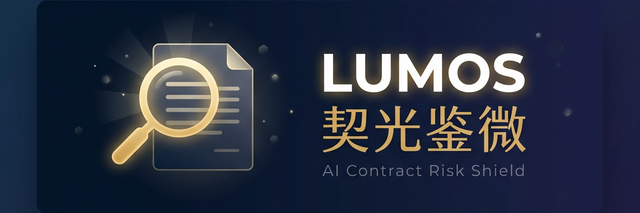

<p align="center">
  
</p>

<p align="center">
  <strong>🔍 开源 AI 合同风险排查助手 · 拍照即查 · 中国劳动法深度适配 · 完全免费</strong>
</p>

<p align="center">
  <a href="./LICENSE"></a>
</p>

<p align="center">
  <a href="#项目背景">项目背景</a> •
  <a href="#核心功能">核心功能</a> •
  <a href="#技术架构">技术架构</a> •
  <a href="./docs/technical-design.md">技术方案</a> •
  <a href="#快速开始">快速开始</a> •
  <a href="#贡献与共建">共建</a>
</p>

---

## 📑 目录

- [项目背景](#项目背景)
- [核心功能](#核心功能)
- [技术架构](#技术架构)
- [项目结构](#项目结构)
- [快速开始](#快速开始)
- [贡献与共建](#贡献与共建)
- [免责声明](#免责声明)

---

## 📖 项目背景

> *"签了个合同，后来才发现有竞业禁止条款，离职后两年不能去同行，违约金还要赔 50 万。"*

每年有超过 **1200 万人** 进入中国就业市场。他们中的大多数人——尤其是应届毕业生和初入职场的年轻人——在签劳动合同时面临一个共同的困境：

| 😰 痛点 | 现状 |
| :--- | :--- |
| 💰 **费用高昂** | 审阅一份合同通常收费 500-2000 元，应届生根本负担不起 |
| 📜 **看不懂** | 晦涩的法律术语，不知道哪些条款暗藏玄机 |
| 😶 **不敢问** | 迫于入职压力，不敢对 HR 提供的格式合同提出质疑 |

现有的 AI 合同审查工具，几乎全部是为**企业法务和律师**设计的。

**Lumos · 契光鉴微** 就是要填补这个空白 —— 它是**第一个完全免费、开源、站在劳动者视角的 AI 合同风险排查助手**。

> 💡 *用光，照见契约中每一个隐形陷阱。*

## ✨ 核心功能

### 🔍 十大坑点智能检测

深度适配中国劳动法，自动扫描合同中最容易给员工挖坑的 **10 类条款**：

> 🔴 **高危区** — 离谱的竞业禁止 · 试用期不发社保、工资打骨折 · 变相强制扣薪
>
> 🟡 **警惕区** — 含糊不清的岗位职责 · "服从公司一切安排" · 苛刻的离职审批
>
> 🟢 **关注区** — 休假权益 · 管辖地争议 · 培训服务期约定

### 📸 极简输入模式

专为移动端场景优化。拿到纸质合同，**拍照即查**（集成端侧 OCR）；同时支持 PDF、Word 上传或直接粘贴合同片段。

### 💬 "说人话"的条款解读

拒绝术语堆砌。AI 会把复杂的条款翻译成你能听懂的 **「大白话」**：

> *"本条款意味着你离职后两年内不能去同行。但由于没明确写补偿金标准，这是严重侵犯你权益的。根据劳动法，如果要签，公司必须每月补偿你离职前工资的 30%。"*

### 🗣️ 一键生成谈判话术

不只告诉你坑在哪，还教你怎么优雅地跟 HR 提要求。AI 会生成可以直接复制、通过微信发送的专业话术，有理有据，不卑不亢。

### MCP 工具箱

后端提供标准化的 MCP（Model Context Protocol）工具接口，支持法条检索、条款分析、风险评分、谈判话术生成等能力，方便二次开发与外部 Agent 集成。

## 🏗️ 技术架构

系统采用 **前后端分离** 的现代 Agent 架构，结合了移动端原生性能、Web 端便捷性与后端强大的 AI 编排能力。

```
┌───────────────────────────────────────────────────────────┐
│              📱 Lumos Client (Flutter APP)                │
│              💻 Lumos Web (Vue 3 + Vite)                    │
│                                                           │
│   [UI 表现层]  扫描合同 → 播放极光动画 → 展示风险卡片         │
│   [通信层]     Dio / Axios Streaming (SSE 接收分析过程)      │
└────────────────────────┬──────────────────────────────────┘
                         │  📤 脱敏后的合同纯文本
                         ▼
┌───────────────────────────────────────────────────────────┐
│              🧠 Lumos Server (Python AI Agent)            │
│                                                           │
│   [API 网关]  FastAPI Endpoints                           │
│   [认证授权]  JWT + API Key                                │
│   [Agent 引擎] Supervisor + 4 个子智能体                   │
│     ├── 1. 结构化抽取：乱序文本 → 标准条款列表               │
│     ├── 2. 法规检索 (RAG)：关键点 → Milvus/ChromaDB 查法条  │
│     ├── 3. 风险审查：多维度打分 + 生成谈判话术               │
│     ├── 4. 谈判策略：为每条风险生成可执行沟通话术            │
│     └── 5. 输出格式化：JSON Stream → 前端                   │
│   [数据持久化] SQLModel + MySQL / SQLite                    │
│   [对象存储]   MinIO (PDF/Word 上传)                        │
│   [向量检索]   Milvus (劳动法条文语义检索)                   │
└───────────────────────────────────────────────────────────┘
```

### 核心技术栈

#### 客户端 — 极致感官篇

| 技术 | 说明 |
| :--- | :--- |
| Flutter 3.x (Dart) | Impeller 引擎，丝滑扫描光效动画 |
| Riverpod + go_router | 类型安全的状态管理与深度链接 |
| Dio (SSE) | 流式实时接收 AI 分析过程 |

#### Web 端 — 便捷访问篇

| 技术 | 说明 |
| :--- | :--- |
| Vue 3 + TypeScript | 组件化、类型安全的现代化前端 |
| Vite | 极速构建工具 |
| Pinia | 状态管理 |
| Element Plus | UI 组件库 |

#### 服务端 — 智能大脑篇

| 技术 | 说明 |
| :--- | :--- |
| FastAPI (Python 3.12) | 极速 + 自带 Swagger 文档 |
| LangGraph / PydanticAI | 循环节点，模型"懂思考、会改错" |
| LangChain / OpenAI SDK | DeepSeek、Claude、通义千问适配 |
| SQLModel + aiomysql | 异步 ORM，MySQL 持久化 |
| Milvus | 向量数据库，法条语义检索 |
| MinIO | 对象存储，合同文件上传 |

> 📄 详细的技术选型与架构设计，请参阅 [技术说明文档](./docs/technical-design.md)

## 📁 项目结构

```
lumos/
├── 📄 README.md
├── 📄 docker-compose.yml        # 一键部署 MySQL/MinIO/Milvus/后端/前端
├── 📄 .env.example              # 环境变量模板
├── 📂 docs/                     # 文档
│   └── technical-design.md      # 技术设计方案
├── 📂 client/                   # Flutter 移动端
├── 📂 web/                      # Vue 3 Web 前端
├── 📂 backend/                  # Python FastAPI 服务端
│   ├── app/
│   │   ├── agent/               # Multi-Agent 编排
│   │   ├── api/                 # FastAPI 路由
│   │   ├── core/                # 配置、数据库、安全、MinIO
│   │   ├── mcp/                 # MCP 工具服务
│   │   ├── models/              # 数据模型
│   │   ├── rag/                 # 向量检索 (Milvus/ChromaDB)
│   │   ├── skills/              # 可复用技能
│   │   └── middleware/          # 中间件
│   └── pyproject.toml
├── 📂 data/                     # 测试数据（合同样本）
└── 📂 public/                   # 静态资源
```

## 🚀 快速开始

### 前置要求

- [Docker](https://docs.docker.com/get-docker/) & [Docker Compose](https://docs.docker.com/compose/install/)
- [Node.js](https://nodejs.org/) 18+（Web 端）
- [Flutter](https://flutter.dev/docs/get-started/install) 3.x+（移动端，可选）
- [Python](https://www.python.org/) 3.12+（服务端开发，可选）

### 一键启动（推荐）

```bash
# 复制环境变量
cp .env.example .env

# 启动所有服务
docker-compose up -d

# 访问
# Web 前端: http://localhost
# API 文档: http://localhost:8000/docs
```

### 本地开发后端

```bash
cd backend
pip install -e ".[dev]"
uvicorn app.main:app --reload
```

### 本地开发 Web 前端

```bash
cd web
npm install
npm run dev
```

### 本地开发 Flutter 客户端

```bash
cd client
flutter pub get
flutter run
```

## 🤝 贡献与共建

Lumos 是一个为劳动者发声的公益开源项目，我们需要多元化的力量：

- ⚖️ **法律从业者** — 完善判例库、优化风险检测规则
- 💻 **开发者** — 提交 PR，优化系统性能与 UI 细节
- 🧑 **每一个打工人** — 分享你踩过的坑，让 AI 学习并保护更多人

欢迎提交 Issue 或 Pull Request！

## ⚖️ 免责声明

**Lumos · 契光鉴微** 是一款基于人工智能的辅助审阅工具。系统检测结果与话术仅供参考，**不构成具有法定效力的专业法律建议**。对于标的额巨大或情况极其复杂的劳动争议，建议您线下咨询专业持证律师。

---

<p align="center">
  <strong>✨ 照见契约中最细微的陷阱</strong>
</p>
<p align="center">
  <sub>Released under the <a href="./LICENSE">Apache 2.0 License</a>. Copyright © 2026 Lumos Contributors.</sub>
</p>
