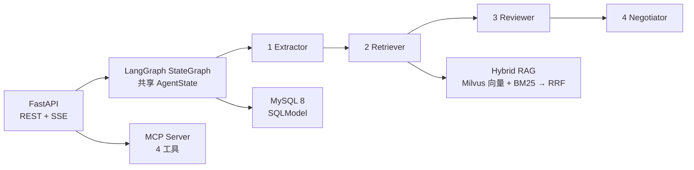

# Lumos Server

Lumos · 契光鉴微 —— AI 合同风险排查引擎后端（FastAPI）。

基于 **LangGraph 状态图**编排 4 阶段子智能体流水线（抽取 → 法规检索 → 风险审查 → 谈判策略），
法规检索采用 **真实 embedding + Milvus 向量 + BM25 关键词 + RRF 融合** 的混合检索链路。



## 技术栈

- **Web 框架**：FastAPI / uvicorn（异步，自动 OpenAPI/Swagger）
- **Agent 编排**：LangGraph `StateGraph`（共享 pydantic `AgentState` + SSE 事件累积）
  - ExtractorAgent → RetrieverAgent → ReviewerAgent → NegotiatorAgent（+ ConsultantAgent 智能咨询）
- **LLM**：LangChain `ChatOpenAI`（OpenAI 兼容接口：DeepSeek / Claude / 通义千问等）
- **RAG 检索**（`app/rag/`）：
  - embedding：`sentence-transformers` 本地模型（默认 `BAAI/bge-base-zh-v1.5`，768 维）或 API embedding，双通道可切换
  - 向量库：Milvus（COSINE；集合名 = 基名 + embedding 签名哈希，换模型自动隔离重建；不可用时向量通道关闭，仅剩 BM25）
  - 关键词通道：BM25（rank-bm25 + jieba 中文分词，领域词典）
  - 融合：Reciprocal Rank Fusion（RRF），生产入口 `search_laws()`
- **协议开放**：MCP Server + Client（JSON-RPC 2.0 over HTTP，4 个工具）
- **其他**：SQLModel + aiomysql（MySQL 8）、MinIO 对象存储、JWT + API-Key 认证、loguru

## 快速开始

> 要求 **Python 3.11+**（`pyproject.toml` `requires-python = ">=3.11"`）。

```bash
cd backend
pip install -e ".[dev]"      # 主依赖已含 sentence-transformers / pymilvus / rank-bm25 / jieba
cp .env.example .env
# 编辑 .env 填入 LLM_API_KEY 等 (embedding 默认本地模型, 无需 API Key)
uvicorn app.main:app --reload --port 8001
# 或直接: python app/main.py  (默认 0.0.0.0:8001)
```

> embedding 通道说明：默认 `EMBEDDING_PROVIDER=local`，权重目录约定为**扁平命名**
> `backend/models/bge-base-zh-v1.5/`（已 gitignore）。目录命中即直接加载并跳过 HF 探测；
> 缺失时按 `HF_ENDPOINT`（默认 `https://hf-mirror.com`）自动下载。也可设
> `EMBEDDING_PROVIDER=api` 走 OpenAI 兼容 embedding 接口。切换模型/通道后
> 向量集合按签名自动重建，无需手工清理。
>
> 日志：开发/生产均写入 `backend/logs/lumos_<日期>.log`（每日轮转、保留 30 天）；
> SQL 回显默认关闭（`DATABASE_ECHO=false`），需要调试 SQL 时再开启。

## 目录结构

```text
backend/
├── app/
│   ├── agent/              # LangGraph 工作流
│   │   ├── graph.py        # StateGraph 构建 + run_contract_analysis (SSE)
│   │   ├── state.py        # AgentState (LangGraph 共享状态, 含 events 通道)
│   │   ├── base.py         # BaseAgent 抽象 (错误捕获/降级)
│   │   ├── llm.py          # ChatOpenAI 工厂
│   │   └── sub_agents/     # extractor/retriever/reviewer/negotiator/consultant
│   ├── api/v1/             # REST/SSE 路由 (19 个端点)
│   ├── rag/                # 混合检索链路
│   │   ├── law_corpus.py   # 法条语料 (5 部法规 29 条条文) + 语料哈希
│   │   ├── embeddings.py   # 真实 embedding 双通道 (local/api)
│   │   ├── bm25_index.py   # BM25 关键词通道 (jieba + 领域词典)
│   │   ├── milvus_store.py # Milvus 向量库 (COSINE/签名集合隔离)
│   │   ├── vector_store.py # 向量通道 + search_laws 混合检索入口
│   │   └── hybrid.py       # RRF 融合
│   ├── mcp/                # MCP 协议 (server/client/tools)
│   ├── models/ schemas/ services/ skills/ core/ middleware/
├── eval/                    # 离线评测工具
│   └── retrieval_eval.py    # data/contracts 金标准 hit@k 三通道对比
├── tests/                   # pytest 单测 (pytest-cov 覆盖率)
├── models/                  # 本地 embedding 权重 (bge-base-zh-v1.5, gitignore)
├── logs/                    # 运行日志 (每日轮转, gitignore)
└── pyproject.toml           # 依赖与工具链配置 (requires-python >=3.11)
```

## 测试与效果评测

```bash
# 1) 单元测试 + 覆盖率 (默认运行, 输出 term 与 htmlcov/)
python -m pytest

# 2) 端到端检索评测 (需真实 embedding/向量库, 显式开启)
LUMOS_E2E=1 python -m pytest tests/test_e2e_retrieval.py -m e2e -q

# 3) 离线金标准评测: 90 份单风险合同 × (向量/BM25/混合) hit@k 对比
python -m eval.retrieval_eval --topk 5
#    报告输出: eval/output/retrieval_eval_latest.{md,json}
```

> 口径边界：pytest 用例数 / 覆盖率是**开发规模与质量指标**；
> 检索 hit@k / MRR 才是**效果指标**（见 `eval/` 报告与 docs/technical-design.md）。

## API 概览

前缀 `/api/v1`（完整定义见 `/docs` Swagger）：

| 方法 | 端点 | 描述 |
|:---|:---|:---|
| `GET` | `/health` `/health/ready` | 健康检查 / 依赖就绪检查 |
| `POST` | `/auth/register` `/auth/login` | 注册 / 登录 |
| `GET` | `/auth/me` | 当前用户 |
| `GET` `POST` | `/contracts` | 合同列表 / 提交分析 |
| `GET` | `/contracts/stats` | 看板统计 |
| `GET` | `/contracts/{id}/stream` | SSE 流式分析过程 |
| `GET` | `/contracts/{id}/report` | 完整报告 |
| `GET` | `/contracts/{id}` | 单条记录 |
| `GET` | `/mcp/tools` | 列出 MCP 工具 |
| `POST` | `/mcp/tools/call` | 调用 MCP 工具 |
| `POST` | `/ingest/file` `/ingest/url` | 文件 / 网页文本摄取 |
| `POST` | `/consult/ask` | 智能咨询（SSE） |
| `GET` | `/consult/sessions` | 会话列表 |
| `GET` | `/consult/sessions/{id}/messages` | 会话消息 |
| `DELETE` | `/consult/sessions/{id}` | 删除会话 |

## 关键环境变量

| 变量 | 默认值 | 说明 |
|---|---|---|
| `LLM_API_KEY` / `LLM_BASE_URL` / `LLM_MODEL_NAME` | — / deepseek / deepseek-chat | 主 LLM |
| `EMBEDDING_PROVIDER` | `local` | `local`(sentence-transformers) \| `api` |
| `EMBEDDING_MODEL_NAME` | `BAAI/bge-base-zh-v1.5` | 本地模型名（预下载到 `models/bge-base-zh-v1.5/`；未命中时经 hf-mirror 自动拉取） |
| `HYBRID_TOP_K_RATIO` / `RRF_K` | `2` / `60` | 混合检索融合参数 |
| `MILVUS_HOST` / `MILVUS_PORT` | localhost / 19530 | 向量库 |
| `DATABASE_URL` | mysql+aiomysql://... | SQLAlchemy 连接串（**不再支持 SQLite**，Docker 由 compose 注入） |
| `DATABASE_ECHO` | `false` | 回显执行 SQL（调试用，默认关闭） |
| `API_SECRET_KEY` | 空（鉴权关闭） | 非空时启用 X-API-Key 鉴权 |

完整清单见 `backend/.env.example` 与 `app/core/config.py`。
