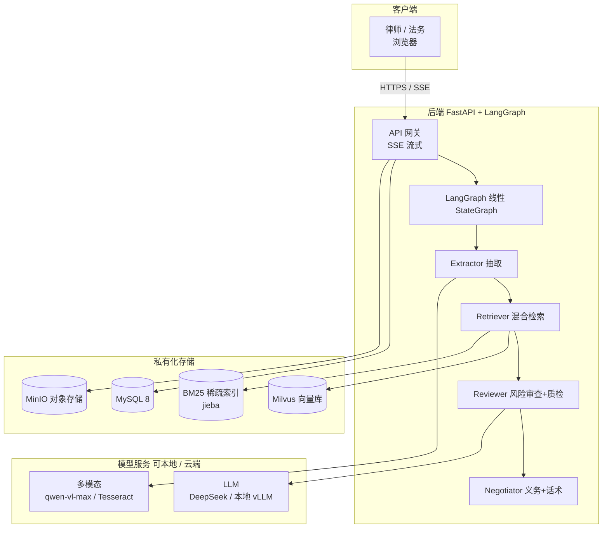
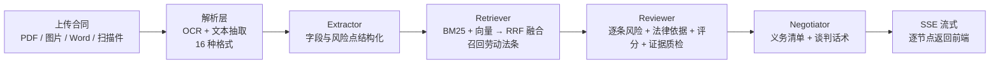

# 契光鉴微 · 劳动法合同风险审查工作台 — 面试准备文档

> 本文档基于工程代码实证撰写，关键事实均附文件坐标，便于面试时经得起深挖。
> 项目代号 **Lumos（契光鉴微）**，定位 **toB** 合同风险审查工作台，交付对象为律师事务所、政府就业指导服务中心。

---

## 一、电梯陈述（30 秒自我介绍用）

> 我做的是一个面向专业法律服务机构（律所、政府就业指导中心）的 **toB 劳动法合同风险审查工作台**。用户上传劳动合同，系统通过「多格式解析 → 多 Agent 审查 → 混合检索召回法条 → 逐条风险标注+法律依据」的流水线，在秒级给出带法条溯源的风险报告与谈判话术。技术上是 FastAPI + LangGraph 编排 4 节点审查流水线（审查节点内置证据质检），检索用 BGE 向量 + BM25 稀疏 + RRF 融合，私有化 Docker Compose 一键部署。离线评测混合检索 hit@5 达 87.8%。

---

## 二、项目背景（toB 口径，已优化版）

劳动法专业服务供需严重错配：需求侧，每年逾千万毕业生初入职场，辖区内劳动者合同法律咨询需求巨大；供给侧，律所与政府就业指导中心受限于人力，律师初审一份合同需 30–60 分钟，服务难以规模化。现有 AI 审查产品多偏资方、以公网 SaaS 交付，缺少中立、可私有化、带法条溯源的专业机构工具。本项目即为面向上述机构的 **toB 合同风险审查工作台**，以私有化部署（文件与向量库本地留存、Docker Compose 一键拉起）交付，LLM 可对接本地模型以满足数据不出域要求；帮助机构提升人均审查产能与覆盖率，每项风险均附法律依据（基于混合检索召回的劳动法条文）。

---

## 三、技术栈

| 层 | 技术 | 说明 / 文件坐标 |
|---|---|---|
| 后端框架 | **FastAPI (Python 3.11)** | `backend/app/main.py`，SSE 流式接口 |
| Agent 编排 | **LangGraph `StateGraph`** | `backend/app/agent/graph.py`，4 节点线性链 |
| 向量库 | **Milvus 2.x** | `backend/app/rag/milvus_store.py` |
| 嵌入模型 | **BGE**（bge-base-zh-v1.5 本地 768 维 / bge-m3 API 1024 维） | `backend/app/rag/embeddings.py` |
| 稀疏检索 | **BM25 + jieba 分词** | `backend/app/rag/sparse.py` |
| 融合策略 | **RRF（k=60）** | `backend/app/rag/hybrid.py` |
| LLM | **DeepSeek**（云端，OpenAI 兼容）/ 可切本地 vLLM | `backend/app/core/config.py` `llm_base_url` |
| 多模态 / OCR | **通义千问 qwen-vl-max** / 本地 **Tesseract** | `backend/app/services/ocr.py` |
| 关系库 | **MySQL 8** | 合同分析结果持久化 |
| 对象存储 | **MinIO**（S3 兼容） | 合同原文 / 解析产物 |
| 前端 | **Vue 3 + Vite + TS + Element Plus + Pinia** | `front/` |
| 部署 | **Docker Compose 一键拉起** | `docker-compose.yml`（mysql/minio/milvus/backend/front） |
| 评测 | **pytest + 金标准集** | `backend/eval/` |

---

## 四、系统架构图

---

## 五、核心业务流程图

---

## 六、核心功能

1. **多格式合同解析**：自研 16 格式解析栈（`text_extractor.py`），覆盖 PDF（含扫描件 OCR）、Word、图片等。
2. **混合检索 RAG**：BGE 稠密向量 + BM25 稀疏，RRF 融合召回劳动法条文。
3. **多 Agent 流水线审查**：4 节点分工（抽取 / 检索 / 审查 / 谈判），审查节点内置证据质检。
4. **风险分级与法律依据**：每项风险标 high/medium/low/safe，附法律依据与评分（0–100）。
5. **谈判话术生成**：针对高风险条款给出可执行的沟通话术。
6. **私有化部署**：Docker Compose 一键拉起全栈，文件与向量库本地留存。

---

## 七、关键技术点详解

### 7.1 为什么用 LangGraph 而不是单一 Chain
- 审查逻辑天然分阶段（抽取 → 检索 → 审查 → 谈判），每阶段职责单一、可独立测试与降级；证据质检与义务提取分别内联在审查、谈判节点中执行。
- 用 `StateGraph(AgentState)` 共享 Pydantic `AgentState`，节点间通过状态传递，避免长 prompt 拼接。
- 线性链（`graph.py:_NODE_SEQ`）即可满足顺序依赖；`graph.astream` 支持逐节点 SSE 回放，前端能实时展示进度。
- 文件坐标：`backend/app/agent/graph.py:38`（节点序列）、`:103`（`build_contract_graph`）、`:160`（`astream`）。

### 7.2 混合检索与 RRF 融合
- **稠密（向量）**：BGE 句向量入 Milvus，擅长语义匹配（"试用期不发工资" 能召回"劳动报酬"相关条文）。
- **稀疏（BM25）**：jieba 分词后词频匹配，擅长精确法律术语（"竞业限制""经济补偿金"）。
- **RRF 融合**：`score_i = Σ 1/(k + rank_i)`，k=60。两者互补，缓解纯向量在罕见法律术语上的召回波动。
- 文件坐标：`backend/app/rag/hybrid.py`。

### 7.3 OCR 策略（图片 + 扫描/混排 PDF 逐页）
- 图片优先**通义千问 qwen-vl-max** 多模态直接读图抽取结构化文本；失败 / 未配置视觉密钥降级本地 **Tesseract** 兜底（`IMAGE_OCR_STRATEGY=auto|llm|tesseract`）；
- **PDF 逐页混合**：`extract_pdf` 先用 pypdf 抽每页文字层，有文字的页直取原文；无文字层的空白页用 PyMuPDF(fitz) 渲染成 PNG 位图，复用同一条图片 OCR 链路识别后拼回；全页无文字层即纯扫描件整体标记 `scanned`；
- 抽取结果统一做空文本 / 乱码 / 有效字符比例校验，避免脏内容污染下游检索与审查；
- 文件坐标：`backend/app/services/text_extractor.py`（`extract_pdf` / `_ocr_pdf_pages` / `extract_image`）。

### 7.4 SSE 流式输出
- 工作流每完成一个节点，runner 预推 `NODE_START`、回放 `NODE_COMPLETE` / `RISK_FOUND` 事件，前端实时渲染进度与逐条风险。
- 文件坐标：`backend/app/agent/graph.py:139`（`run_contract_analysis`）。

### 7.5 容错降级
- **Reviewer LLM 失败** → `_fallback` 规则审查（按已抽取条款 category 给 medium 级预警），保证链路不中断（`reviewer_agent.py:122`）。
- **OCR 多模态失败** → 本地 Tesseract 兜底。

---

## 八、难点与解决

| 难点 | 解决 |
|---|---|
| 纯向量检索对罕见法律术语召回不稳 | 引入 BM25 稀疏 + RRF 融合，hit@5 较单向量（0.833）再提升至 0.878 |
| 扫描件 / 图片 / 混排 PDF 无法直接抽取 | 多模态 OCR（qwen-vl-max）+ 本地 Tesseract 兜底；PDF 逐页混合，无文字层页渲染位图后 OCR |
| 长合同单次 LLM 调用易遗漏 / 超时 | 拆为 6 阶段 Agent，逐条审查 + 质检门 |
| 前端等待焦虑 | SSE 逐节点流式，实时进度 |
| 机构数据合规（不希望合同出域） | 文件/向量库本地化；LLM 可对接本地 vLLM 满足数据不出域 |

---

## 九、评测指标（离线真实数据）

来源：`backend/eval/output/retrieval_eval_latest.md`（评测时间 2026-09-10）。

- **结构化法条库**：98 条《劳动合同法》(2012 修正) 全文结构化（每条带 `law_name`/`article`/`content`/`keywords`/`category`/`source`，见 `app/rag/data/labor_contract_law_2012.json`，由 `scripts/import_labor_contract_law.py` 导入 Milvus）；**金标准样本**：90 条标注查询（9 类风险 × 10，见 `eval/output/gold_queries.json`）。
- **检索 hit@k / MRR@5 对比**：

| 通道 | hit@1 | hit@3 | hit@5 | MRR@5 |
|---|---|---|---|---|
| vector（纯向量） | 0.489 | 0.656 | 0.833 | 0.613 |
| bm25（纯稀疏） | 0.322 | 0.433 | 0.700 | 0.437 |
| **hybrid（生产入口）** | **0.389** | **0.789** | **0.878** | **0.585** |

- **结论**：混合检索在 hit@5（0.878）上优于任一单通道，是生产默认入口；hit@1 略低于纯向量，说明首位精确性仍有优化空间（可叠加重排 Cross-Encoder）。
- **耗时**：人工初审 30–60 分钟/份，系统秒级（实测 < 10s）返回。
- **自动化测试**：30 条 pytest 用例（检索链路 18 + API 冒烟 8 + 工作流状态流转 4，见 `backend/tests/`）覆盖检索 / 状态流转 / 接口。
- ⚠️ 口径提醒：以上为「检索效果」指标；测试用例数、代码行数等属「开发规模指标」，简历中勿混用。

---

## 十、高频面试 Q&A（含诚实作答）

### Q1：为什么选 LangGraph？直接写一串 prompt 不行吗？
**答**：审查是多阶段、有状态依赖的任务。用 `StateGraph` 把“抽取/检索/审查/谈判”拆成独立节点，共享 `AgentState`，每个节点可单独单测、单独降级（如 Reviewer LLM 挂了能走规则兜底）；证据质检、义务提取作为节点内独立逻辑执行，同样可单测。线性链用 `astream` 还能天然支持 SSE 进度流。如果只拼一条长 prompt，既难维护也难以做逐节点容错。

### Q2：混合检索相比纯向量好在哪？
**答**：向量检索擅长语义，但对"竞业限制""经济补偿金"这类固定法律术语容易漏；BM25 正好补术语精确匹配。RRF（k=60）融合两者排名，评测显示 hit@5 从纯向量 0.833 提升到 0.878。

### Q3：RRF 的 k 怎么定的？
**答**：k 控制排名靠后结果的衰减速度，经验值 60。我们没做大规模超参搜索，k=60 是常见基线；若要进一步优化首位精度，会叠加 Cross-Encoder 重排（目前 hit@1=0.389 是已知优化点）。

### Q4：怎么保证"法条溯源"准确？会不会 AI 瞎编法条？
**答**：（诚实）Reviewer 的 `legal_basis` 是 LLM 生成文本，但做了两层约束：①上下文只注入 **Retriever 真实召回的法条**（`reviewer_agent.py` 的 `_build_context` 注入 `state.legal_references`），形成检索锚点、不是凭空生成；②审查节点内联的证据质检（Quality Gate）对每条依据做**三重校验**——原文能否在合同全文定位、法律依据是否为空、以及用正则从 `legal_basis` 抽取「法名+条号」（中文/阿拉伯数字归一后比较）与召回法条逐条**溯源核验**，命中不了即标注「依据待人工复核」并按条扣减置信度。诚实边界：仍是自由文本而非强制结构化引用，正则只能核验「能否在召回结果里溯源」，不能保证模型不引用语料库外条文或改写措辞，**正式交付建议人工复核关键条款**；把依据收敛为只允许引用召回法条的结构化索引是下一步补强方向。

### Q5：数据不出域是怎么做的？
**答**：（诚实，重点）文件存储、向量库、数据库全部本地（MySQL/MinIO/Milvus），**不依赖第三方 SaaS 审查平台**。但默认配置的 LLM 与多模态 OCR 走的是 DeepSeek / 通义千问云端 API，**合同文本在推理时会出域**。要做到真正"数据不出域"，需把 `llm_base_url` 指向本地 vLLM/Ollama（代码已支持 OpenAI 兼容），OCR 用本地 Tesseract——这一路已在架构上预留，是按客户合规要求可切换的部署形态。面试时我会如实区分"存储私有化"与"推理私有化"两层。

### Q6：审查立场是中立还是偏劳动者？
**答**：（诚实）当前 Reviewer 系统提示词写的是"站在劳动者立场的合同风险审查专家"（`reviewer_agent.py:20`），因为产品最初面向劳动者。改为 toB 交付律所/政府后，目标立场是**中立专业**——这更契合专业机构"对双方负责"的定位。提示词已规划改为"中立专业的合同风险审查专家"，使简历口径与实现一致。

### Q7：为什么私有化部署而不是做 SaaS？
**答**：目标客户是律所和政府就业指导中心，合同含敏感个人信息，合规要求"数据不出域、可内网部署"。Docker Compose 一键拉起降低交付门槛，无公网入口更可控。

### Q8：检索效果不错，但审查最终质量怎么衡量？
**答**：目前离线评测聚焦检索层（hit@k / MRR）。审查质量靠 RiskAssessment 结构（等级/评分/依据）做结构化输出，并用审查节点内的证据质检；更严谨的端到端审查准确率评测是后续规划项，当前以检索指标 + 规则兜底稳定性作为工程保障。

### Q9：为什么不直接用 LlamaIndex / LangChain 全家桶？
**答**：分层看——
- **解析层**：合同解析本质是「按扩展名分发」的确定性工作（pypdf / python-docx / openpyxl / python-pptx，RTF·HTML 用纯标准库零依赖，共 16 格式 + 三级 OCR，见 `text_extractor.py`）。LlamaIndex 的价值主要在 `LlamaParse` 复杂版面托管解析（联网/配额），这里收益不大；自研更轻、可逐行审计、镜像更小，契合私有化交付。
- **检索层**：本项目的核心竞争力恰恰在混合检索的细节定制——RRF 融合分与 `similarity` 显式分开算、双通道加权（向量×0.65 + BM25 归一×0.35）+ 单通道折扣、Milvus 不可用时降级为纯 BM25、按 embedding 签名隔离集合自动重建、jieba 法律领域词典、金标准 hit@k 直接对接 `search_laws` 每一路分数（`rag/{vector_store,hybrid,bm25_index,reranker}.py`）。用框架的 `QueryFusionRetriever` / rerank 包装反而要打洞改抽象，不如自研透明可控、便于离线评测与法条溯源。
- **编排层**：多 Agent / 状态共享 / 流式回放已由 **LangGraph StateGraph** 承担（见 Q1），LlamaIndex 的 engine·query pipeline 与它职责重叠，混用会出现两套编排心智模型。至于 LangChain：只用了它生态里稳定的原子件（`ChatOpenAI`、sentence-transformers 封装），**没有用它的 Chain 做编排**——编排交给了更合适的 LangGraph。
- **诚实补充（什么时候该上 LlamaIndex）**：若需求变成上百种异构数据源连接器、快速搭 RAG 原型、复杂版面表格解析、想省掉向量库适配层——它的 Reader/Index/Retriever 全家桶能显著提效，值得引入。本项目不用是「知道框架、也知道为什么不用」的主动选型，而非不知道。
- ⚠️ **口径红线**：代码对 LlamaIndex 零引用，简历**不要**写它（另见第十一节）；被追问就答「自研轻量解析栈 + 自建混合检索（双路召回 + RRF + 精排），LangGraph 负责编排」。

---

## 十一、深挖追问应对清单

| 追问 | 应对要点 |
|---|---|
| "你的 RAG 用过 LlamaIndex 吗？" | 没有。技术设计文档明确"未采用 LlamaIndex"，解析与检索均为自研（`docs/technical-design.md`）。简历**不要**写 LlamaIndex。 |
| "hit@1 只有 0.389，够用吗？" | 这是首位精确性指标；生产看重 hit@5（0.878）召回覆盖，且每条风险都经 Reviewer 二次判断 + 节点内证据质检，不是纯靠首位。已规划 Cross-Encoder 重排优化首位。 |
| "90 条金标准是不是太少了？" | 坦诚：当前是 9 类×10 的单风险区基线集，多风险混合的"综合区"尚未纳入自动评测（评测报告已注明）。下一步扩充综合样本与端到端审查集。 |
| "并发 / 性能如何？" | 无生产压测数据；架构上 FastAPI 异步 + Milvus 向量检索本身高吞吐，单份秒级。大规模并发需接本地模型 + 队列，属部署调优范畴。 |
| "和市面 AI 审查工具差异？" | 中立/可私有化/带法条溯源 + toB 定位，且检索层有离线量化评测支撑，不是纯黑盒。 |

---

## 十二、附：关键文件坐标索引

- 编排：`backend/app/agent/graph.py`
- 抽取：`backend/app/agent/sub_agents/extractor_agent.py`
- 检索：`backend/app/agent/sub_agents/retriever_agent.py`、`backend/app/rag/{hybrid,sparse,milvus_store,embeddings}.py`
- 审查（含证据质检）：`backend/app/agent/sub_agents/reviewer_agent.py`（立场提示词 line 22、降级 line 125、质检 line 150）
- 谈判（含义务提取）：`backend/app/agent/sub_agents/negotiator_agent.py`
- 配置：`backend/app/core/config.py`
- 评测：`backend/eval/output/retrieval_eval_latest.md`
- 部署：`docker-compose.yml`

---

> **诚实声明**：本简历项目为个人 from-scratch 工程，数据规模（90 条金标准、29 条法条）属小型离线基线，面试中如实表述，不夸大；检索指标与开发规模指标严格区分。
