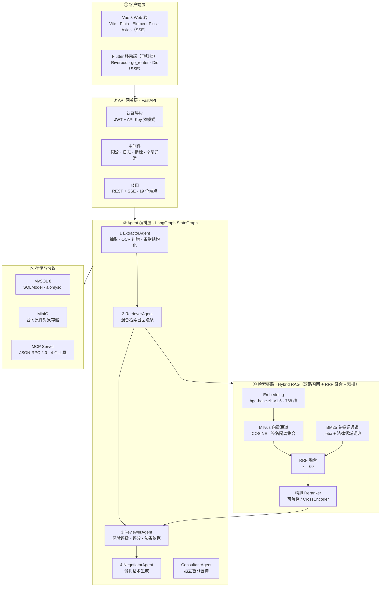
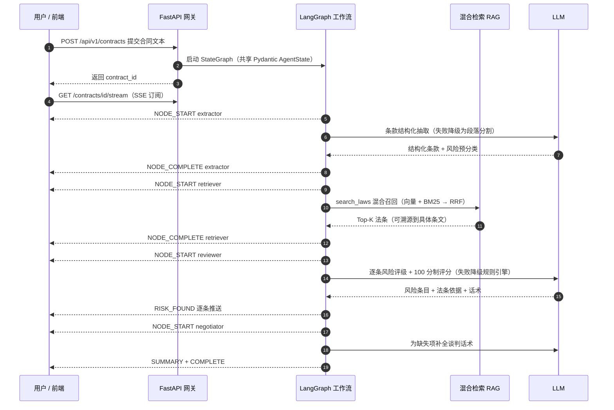
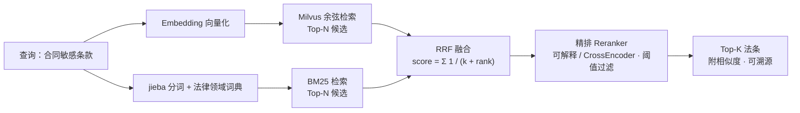

# 契光鉴微 —— AI 合同风险排查助手（简历项目介绍）

> **一句话定位**：从 0 到 1 独立开发的**面向专业机构的 toB 合同风险审查工作台**——以本地化私有部署（数据不出域）形式交付律师事务所、政府就业指导服务中心，Agent 逐条审查、法条可溯源、话术可直接谈判，多端覆盖（Flutter App + Vue Web + FastAPI Agent 服务端）。

---

## 一、项目描述

每年逾千万高校毕业生初入职场（2025 届达 1222 万人，创历史新高），辖区劳动者法律咨询量极为庞大；而律师事务所、政府就业指导服务中心等专业机构受限于专业人力，律师人工初审一份劳动合同需 30–60 分钟，公益与批量服务难以规模化覆盖。市面上的 AI 合同审查工具多面向企业法务/律师、以公网 SaaS 交付且立场偏资方，缺少面向专业服务机构的中立、可私有化、带法条溯源的工具。

本项目定位 **面向律师事务所与政府就业指导服务中心的 toB 合同风险审查工作台**，填补这一市场空白：

- **拍照即查**：纸质合同/截图拍照上传，即可完成一份「说人话」的风险排查报告；
- **专业分层**：不止告诉你「哪条有坑」，还给出**大白话解读 + 具体法律条文依据 + 可直接复制发给 HR 的谈判话术**；
- **全流程透明**：从上传到出报告，AI 每个分析环节（抽取→检索→审查→谈判）以 SSE 事件流实时推送到前端，用户可看到「思考过程时间线」；
- **多端触达**：Flutter 移动端（iOS/Android）+ Vue3 Web 端共用同一 Agent 后端。

整体是一个**前后端分离 + LangGraph 多智能体编排 + 混合检索 RAG + MCP 协议开放**的 AI 应用，7 个容器 Docker Compose 一键部署。

---

## 二、技术栈

**服务端（Python AI Agent）**

| 分类 | 技术 |
| :--- | :--- |
| Web 框架 | FastAPI + Python 3.11+ + uvicorn（异步，自动 OpenAPI/Swagger） |
| AI/Agent | OpenAI 兼容接口（LangChain ChatOpenAI，可切换 DeepSeek / Claude / 通义千问） |
| 编排 | **LangGraph 1.x StateGraph**：extract → retrieve → review → negotiate 四节点线性工作流，节点共享 Pydantic `AgentState`，事件累积进 state 由 SSE runner 增量回放（`graph.astream`）；节点级错误降级不中断全图 |
| RAG 检索 | 自建劳动法条文知识库（14 部现行法律法规完整条文 659 条、内容哈希驱动自动重建）；**混合检索**：向量通道（Milvus，COSINE / embedding 签名隔离集合；不可用时自动关闭仅剩 BM25）+ **BM25 关键词通道**（jieba 分词 + 法律领域词典）→ **RRF 融合** |
| Embedding | **真实模型双 Provider**：本地 sentence-transformers（默认 `BAAI/bge-base-zh-v1.5`，768 维中文检索，query 指令前缀）/ OpenAI 兼容 `/embeddings` API；向量空间不一致时按签名自动重建索引 |
| OCR/多模态 | 多模态视觉 LLM（通义千问 VL）抽取 + Tesseract（chi_sim+eng）本地兜底，auto/llm/tesseract 三级策略 |
| 文档解析 | pypdf / python-docx / openpyxl / python-pptx / 纯标准库 RTF·HTML 解析——支持 16 种扩展名 |
| 数据库 | SQLModel + aiomysql（MySQL 8，长文本 MEDIUMTEXT 适配） |
| 对象存储 | MinIO（PDF/Word/图片原件） |
| 协议开放 | 内置 **MCP Server + Client**（JSON-RPC 2.0 over HTTP），对外暴露 4 个工具 |
| 安全/运维 | JWT + API-Key 双模式认证、限流/日志/指标/全局异常中间件、loguru 日志 |
| 测试与评测 | pytest **27 条用例**（默认跑 25：API 冒烟/BM25/RRF 融合/向量通道异常仅 BM25 兜底/LangGraph 工作流；2 条 e2e 需 `LUMOS_E2E=1`）+ `pytest-cov` 行覆盖率（~55%）+ 离线检索评测脚本（90 条金标准 hit@k/MRR） |

**Web 端（Vue 3）**：Vue 3 + TypeScript + Vite + Pinia + Element Plus + Axios（SSE 流式）

**移动端（Flutter，已归档至 `archive/client/`）**：Flutter 3.x + Riverpod（代码生成）+ go_router + Dio（SSE 流式）

**部署**：Docker Compose 一键编排 7 个服务（MySQL / MinIO / Milvus-etcd / Milvus-minio / Milvus-standalone / backend / front·Nginx 托管）

---

## 三、系统架构

### 3.1 总体架构（五层）



### 3.2 一次合同分析的全链路（LangGraph 4 节点 + SSE 时间线）



> 健壮性：任一节点异常不中断全图——子智能体捕获错误写入 `state.errors` 并转 `THINKING` 警告事件继续执行，保证「永远有结果」而非报错。

### 3.3 混合检索链路（双路召回 + RRF 融合 + 精排）



> 向量通道不可用（Milvus 未就绪）时自动关闭，仅保留 BM25 关键词通道，服务不中断；索引按「语料哈希 + embedding 签名」双校验自动重建，换模型不产生脏索引。

---

## 四、工作内容

**1. 产品与数据设计**
- 调研中国劳动法高频纠纷，抽象出 **10 大类风险坑点**（竞业禁止、试用期薪资/社保、变相扣薪、岗位职责模糊、服从安排无条件调岗、离职审批、休假权益、管辖地争议、培训服务期等），并将其建模为风险分类枚举，驱动后续 Prompt 与审查全链路；
- 整理并标注 **100 份覆盖上述坑点的劳动合同样本测试语料**（按高危/警惕/关注/综合分区组织），用于链路联调与效果验证。

**2. LangGraph 分析引擎（核心）**
- 用 **LangGraph `StateGraph`** 编排 4 阶段节点：Extractor（OCR 纠错 + 条款结构化拆分与风险预分类）→ Retriever（对敏感条款混合召回相关法条）→ Reviewer（逐条风险评级 + 100 分制整体评分 + 法条依据）→ Negotiator（补全谈判话术）；
- 设计 Pydantic `AgentState` 作为图共享状态（抽取条款/风险条目/法条引用/评分 + **事件通道** `events`）：节点内产生的 `THINKING / NODE_COMPLETE / RISK_FOUND` 按序累积，runner 用 `graph.astream(stream_mode="values")` 增量回放，`NODE_START` 按图序预推——保持「节点开始→思考→完成」的原始 SSE 时间线语义；
- 关键健壮性设计：**任一节点失败自动降级不中断全图**——抽取失败降级为段落分割、审查失败降级为规则引擎审查，子智能体异常写入 `state.errors` 转 `THINKING` 警告事件，保证服务「永远有结果」而非报错。

**3. 混合检索 RAG（真实 Embedding + BM25 + RRF）**
- 接入**真实 embedding 模型双 Provider**（本地 sentence-transformers 默认 `BAAI/bge-base-zh-v1.5`（768 维）/ API 可选），替换早期占位向量；向量索引按「法条语料哈希 + embedding 签名」双校验自动重建，Milvus 集合名带签名后缀隔离，换模型/换语料不产生脏索引；
- 实现**向量 + BM25 双通道混合检索**：向量通道为 Milvus（COSINE，schema 维度跟随 embedding 签名动态建集合，PyMilvus 3.x 行式 API），不可用时向量通道自动关闭、仅剩 BM25 关键词通道；BM25 通道基于 jieba 分词 + **法律领域词典**（修复「竞业限制」等法律术语切词）；
- 双通道结果经 **RRF（Reciprocal Rank Fusion, k=60）** 融合排序，缓解异源分数不可比问题；检索结果拼接进 Reviewer 上下文，实现**答案可溯源到具体法条**。

**4. 效果评测体系（新增）**
- 从 6 条冒烟用例扩展至 **27 条 pytest 用例**（默认跑 25：检索单测/工作流图测试/API 冒烟；另 2 条 e2e 需 `LUMOS_E2E=1` 触发真实链路），接入 `pytest-cov` 行覆盖率统计；单测真实发现并修复两个生产缺陷：rank_bm25 查询需预分词（字符串按字符迭代产生伪分数）、jieba 需注册领域词典；
- 建立**离线检索评测**：以 90 份单分类金标准合同（9 类风险 × 10 份）抽取风险句为查询，对比向量 / BM25 / 混合三通道 `hit@1/3/5` 与 `MRR@5`（详见 §5.4），量化 RRF 融合收益。

**5. 多格式文档/图片摄取**
- 实现 16 种扩展名（PDF/DOCX/RTF/TXT/CSV/MD/HTML/XLSX/PPTX + 图片）文本抽取：PDF 扫描件识别、RTF/HTML 纯标准库零依赖解析、中文多编码（utf-8-sig→gb18030→latin-1）自动探测；
- **图片/拍照上传**：接入多模态视觉 LLM 抽取文字（保留表格/排版、支持手写与中文），失败自动回退本地 Tesseract OCR，策略可配置。

**6. MCP 协议开放 + 智能咨询**
- 自建 MCP Server（JSON-RPC 2.0 over HTTP）：将法条检索、条款分析、风险评分、谈判话术 4 项能力暴露为标准 `tools/list` / `tools/call` 接口，并配套 MCP Client 可连外部队列服务，便于二次开发与外部 Agent 集成；
- 独立实现 ConsultantAgent 智能咨询模块：支持多轮自由问答、法条引用标注、追问建议，并关联已分析合同的上下文。

**7. 前端三端落地**
- **Web**：搭建 Vue3 工程，实现登录注册（JWT 守卫）、数据看板、合同分析页（SSE 极光等待动画→风险卡片→完整报告）、报告列表、智能咨询、MCP 工具箱等完整页面；实现会话历史持久化与管理；
- **移动端（Flutter）**：搭建 Riverpod + go_router 工程，实现扫描、上传/文本输入、分析过程动画、报告、MCP 工具列表等页面与端侧状态管理。

**8. 部署与工程化**
- 编写 Docker Compose 一键部署编排（7 容器）、多环境变量体系（数据库/LLM/Embedding/混合检索/安全/向量库/对象存储分组建模于 pydantic-settings）、Nginx 前端托管、OpenAPI 自动文档；
- 编写 README / 各模块说明 / 技术设计文档（含实现现状附录），沉淀 AI Agent 架构与落地经验。

---

## 五、项目成果（量化数据，均可仓库内自证）

> 本节每个数字都对应仓库内的真实代码/文件，可直接复现；面试被追问「哪来的数据」时，可按【来源】列逐一指认。

### 5.1 交付规模（开发规模指标，非效果指标）

| 维度 | 数据 | 说明 / 来源 |
| :--- | :--- | :--- |
| 产品形态 | **三端全栈闭环**（Flutter App + Vue3 Web + FastAPI Agent） | 「拍一张纸质合同」→ 带法条依据的逐条风险报告 + 可复制谈判话术，全流程跑通 |
| 交付周期 | **3 天 22 次提交**（2026-09-07 ~ 09-09） | 单人主导、高密度迭代交付（`git log`） |
| 服务端代码量 | **66 个 Python 模块 / 4,731 行非空代码**（不含测试与评测脚本） | `backend/app/**/*.py`（统计口径：非空行；其中 RAG 检索链路与评测为本轮新增） |
| Web 端 | **19 个源文件**（页面 7 个 + 路由/Store/API 封装） | `front/src/**/*.{vue,ts}` |
| 移动端（已归档） | **23 个 Dart 源文件**（功能页 + Riverpod 状态 + 路由 + 组件） | `archive/client/lib/**/*.dart` |
| 自动化测试 | **27 条 pytest 用例**（默认跑 25：API 冒烟 6 / 检索链路 15 / LangGraph 工作流 4；另 2 条 e2e 需真实模型触发） | `backend/tests/` |
| 覆盖率 | **pytest-cov 行覆盖率 ~55%**（RAG 核心模块 70%+，Milvus 真实服务分支由 e2e 覆盖） | `python -m pytest --cov=app` |
| 检索评测 | **90 条金标准**离线评测脚本（9 类 × 10 份，hit@k/MRR 三通道对比） | `backend/eval/retrieval_eval.py` |
| 一键部署 | **7 个容器** Docker Compose 编排（MySQL/MinIO/Milvus×3/backend/front） | `docker-compose.yml` |

### 5.2 能力覆盖深度

| 能力 | 数据 | 来源 |
| :--- | :--- | :--- |
| 风险检测 | **10 大劳动法坑点**全覆盖建模（竞业限制/试用期薪资社保/扣薪/调岗/离职审批/休假/管辖/培训服务期…） | `models/analysis.py` `RiskCategory` |
| 测试语料 | **100 份**真实中文劳动合同样本，按高危/警惕/关注/综合 **4 级分库**、一一对应坑点类别 | `data/contracts/` |
| 法规知识库（RAG） | **14 部现行劳动法律法规完整条文（659 条）**，全部取自政府官网公开文本（gov.cn / npc.gov.cn / court.gov.cn / mohrss.gov.cn），含 2025 年《劳动争议司法解释二》，逐条打风险标签供检索，内容哈希驱动自动重建 | `rag/law_corpus.py`、`rag/data/` |
| 检索通道 | **真实 embedding**（本地 sentence-transformers，默认 BAAI/bge-base-zh-v1.5 / API 双 Provider）+ **BM25/jieba 领域词典** + **RRF 融合**；Milvus 不可用时仅剩 BM25 | `rag/embeddings.py`、`rag/bm25_index.py`、`rag/hybrid.py` |
| Agent 编排 | **LangGraph StateGraph 4 节点**流水线 + **1 个咨询智能体**，配套 **5 项可复用技能**注册表 | `agent/graph.py`、`skills/` |
| 协议开放 | **4 个 MCP 标准工具**（法条检索/条款分析/风险评分/谈判话术），JSON-RPC 2.0 over HTTP | `mcp/tools/` |
| API 面 | **19 个 REST/SSE 端点**（认证 3 / 合同 6 / 咨询 4 / MCP 2 / 摄取 2 / 健康 2） | `api/v1/` 各 router |
| 流式体验 | **7 类 SSE 事件**驱动分析全过程可视化（NODE_START/COMPLETE→THINKING→RISK_FOUND→SUMMARY→COMPLETE） | `schemas/analysis.py` `SSEEventType` |
| 文件摄取 | **16 种扩展名**解析（PDF/DOCX/RTF/XLSX/PPTX/HTML/图片…）；图片走「多模态视觉 LLM + Tesseract 本地 OCR」双引擎、3 级策略、PDF 扫描件自动识别 | `services/text_extractor.py` |

### 5.3 工程健壮性（由代码设计支撑，非性能虚标）

- **LLM 全链路失败降级**：条款抽取失败→自动降级为段落分割；风险审查失败→降级为规则引擎审查；LangGraph 节点级异常仅记录并转警告事件继续下一节点——**核心服务可用性不依赖模型可用性**；
- **向量通道可用性降级**：向量库唯一后端为 Milvus，不可用时向量通道自动关闭、仅保留 BM25 关键词检索，服务不中断；索引按「语料哈希 + embedding 签名」自动重建、集合名签名隔离，杜绝脏数据；
- **单元测试反哺生产**：测试真实发现并修复 rank_bm25 查询预分词、jieba 法律领域词典缺失两个检索正确性缺陷；
- **鉴权与防护**：JWT + API-Key 双模式认证、限流/请求日志/指标/全局异常 4 类中间件齐备；
- **可扩展架构**：底层 LLM 走 OpenAI 兼容层（DeepSeek/Claude/通义千问可一键切换）；embedding 可本地/API 无缝切换（签名自动隔离重建）；新增风险品类/能力只需注册新 Skill 或 MCP 工具即可接入主链路。

### 5.4 效果类指标（已实测 / 待评测，请勿混用口径）

> ⚠️ 口径边界：**§5.1 的行数/用例数/语料份数是开发规模指标，不是效果指标**；效果指标必须由评测产出，二者不可互相包装。

**已实测（仓库内可直接复现）：**

- **检索效果评测**：`backend/eval/retrieval_eval.py` 以 90 份金标准（9 类风险 × 10 份）跑向量 / BM25 / 混合三通道，输出 hit@1/3/5 与 MRR@5（结果存 `backend/eval/output/`）。**2026-09-09 实测**（本地真实 embedding BAAI/bge-base-zh-v1.5，768 维，29 条法条文语料）：

| 通道 | hit@1 | hit@3 | hit@5 | MRR@5 |
| :--- | :--- | :--- | :--- | :--- |
| 向量（真实 embedding） | 0.489 | 0.656 | 0.833 | 0.613 |
| BM25（jieba 领域词典） | 0.322 | 0.433 | 0.700 | 0.437 |
| 混合（RRF 融合） | 0.389 | 0.789 | **0.878** | 0.585 |

  **如实解读**：榜首精度纯向量居首（hit@1 48.9%），融合次之（38.9%）——29 条小语料下 BM25 噪音会拉低融合榜首，勿表述成「混合全面优于向量」；但 RRF 融合的**召回广度优势显著**：hit@3 达 78.9%、hit@5 达 **87.8%**，均明显高于纯向量（65.6% / 83.3%）——这正是后续用更大语料 / 调 rrf_k 的优化方向。

- **单元/工作流测试**：默认 25 条用例全绿 + 2 条 e2e（真实模型链路）通过，行覆盖率 ~55%——属于开发规模与工程完备度证据。

**待评测（如实口径，勿编造）：**

- **合同级风险检出准确率**（抽取→检索→审查全链路对金标准的命中率）尚未做端到端系统评测——需真实 LLM Key 跑 `data/contracts/` 样本并对齐标注后给出可复现数字；
- 仓库本身不含用户/流量数据：GitHub Star / 注册用户 / 单份合同耗时等运营指标以真实来源为准，不虚标。

---

## 六、⚠️ 撰写提示（面试前必读，避免被追问穿帮）

> 2026-09-09 迭代后，此前文档与实现的出入点已全部修复：**真 LangGraph StateGraph**（`agent/graph.py`，原自研 Supervisor 编排器已删除）、**BM25 混合检索已实现**（jieba + RRF）、**真实 embedding 已接入**（双 Provider，本地默认 BAAI/bge-base-zh-v1.5、768 维，非占位向量）、**Milvus 为向量通道唯一后端**（不可用时自动关闭仅剩 BM25，无 ChromaDB 降级）、**27 条用例（25 默认 + 2 e2e）+ 覆盖率 + 检索评测已就位**。现在按本文件表述即可与代码一一对应。仍需注意：

1. **量化口径边界**：`backend/app` 行数（66 模块 / 4,731 非空行）、语料份数（100 份）、用例条数（25）等是**开发规模指标**，检索 hit@k/MRR 是**检索环节效果指标**（5.4 已给出评测命令与结果表），而**「合同级检出准确率」尚未评测**——切勿把「写了 XX 行代码/建了 XX 份语料」表述为「准确率达 XX%」，也不要把 hit@k 说成合同检出率；
2. **Milvus 需要真实服务**：覆盖率中 Milvus 分支由 e2e 用例覆盖；演示/面试环境若无 Milvus，向量通道自动关闭、仅剩 BM25 关键词检索（应用仍可用），可如实说明「向量不可用时仅 BM25 兜底」设计而非声称生产环境跑过 Milvus；
3. **embedding 模型本地持久化**：默认 BGE 模型已预下载到 `backend/models/bge-base-zh-v1.5/`（409MB）；首次在其它机器运行会经 hf-mirror 自动拉取，面试演示前请先预热缓存；
4. **运行口径**：`python -m pytest`（默认跳过 e2e）与 `LUMOS_E2E=1 python -m pytest -m e2e` 两条命令请分清；`backend/eval/` 评测输出文件已 gitignore，重新跑评测后数字可能微调。

如需在此基础上润色为纯文本版（去表格、压行数到 15–20 行）以适配常见简历排版，告诉我即可。

---

## 附录 A：技术落地细节（文件坐标 + 代码片段）

> 本附录逐块给出「实际怎么写出来的」，每项均可在仓库内按文件坐标指认源码；面试被追问实现细节时按此回答即可。
> ⚠️ **口径红线**：文档解析**未使用 LlamaIndex**（仅 `docs/technical-design.md`「文档进阶」设想栏列过，代码零引用），实际是自研轻量解析栈，切勿在简历里写 LlamaIndex。

### A.1 向量库索引（Milvus）

**文件**：`backend/app/rag/milvus_store.py`

- 客户端用 PyMilvus 3.x `MilvusClient`（已从 ORM 式 `Collection.*` 迁移，消除 3.1 弃用告警）；
- 索引 `IVF_FLAT` / metric `COSINE` / `nlist=128`，检索 `nprobe=16`；向量为真实 bge 768 维、已归一化；
- 集合按 **embedding 签名**隔离：`labor_laws_<sha256(sig)[:8]>`，换模型/换语料自动重建，并带语料漂移检测。

```python
# milvus_store.py — 索引定义（MilvusClient 客户端 API）
index_params = get_milvus_client().prepare_index_params()
index_params.add_index(
    field_name="embedding",
    index_type="IVF_FLAT",
    metric_type="COSINE",
    params={"nlist": 128},
)

# 集合名 = 基名 + embedding 签名哈希（8 位），换模型自动隔离重建
def collection_full_name() -> str:
    sig_hash = hashlib.sha256(embedding_signature().encode("utf-8")).hexdigest()[:8]
    return f"{settings.milvus_collection}_{sig_hash}"
```

### A.2 文档解析（自研栈，16 种扩展名，**非 LlamaIndex**）

**文件**：`backend/app/services/text_extractor.py`

按扩展名派发的 `_EXTRACTORS` 表：PDF→`pypdf`、DOCX→`python-docx`、XLSX→`openpyxl`、PPTX→`python-pptx`、RTF/HTML→**纯标准库**（无第三方依赖）、TXT/CSV/MD→多编码探测、图片 6 种→走 OCR。

```python
# text_extractor.py — 扩展名派发表（16 种）
_EXTRACTORS: dict[str, object] = {
    "pdf": extract_pdf, "docx": extract_docx,
    "txt": extract_txt_csv, "csv": extract_txt_csv, "md": extract_txt_csv,
    "html": extract_html, "htm": extract_html, "rtf": extract_rtf,
    "xlsx": extract_xlsx, "pptx": extract_pptx,
    "png": extract_image, "jpg": extract_image, "jpeg": extract_image,
    "gif": extract_image, "webp": extract_image, "bmp": extract_image,
}

# RTF 纯标准库单遍扫描（零依赖示例）
def extract_rtf(data: bytes) -> tuple[str, bool]:
    raw = data.decode("latin-1", errors="replace")
    # 单遍扫描 + 分组栈，剥离控制字，跳过头/字体/页脚等属性组
    ...
```

> PDF 扫描件无文字层：`extract_pdf` 返回 `is_scanned=True`，上层据此改走 OCR 路径。

### A.3 OCR（图片 / 扫描件，三级策略）

**文件**：`backend/app/services/text_extractor.py`（`extract_image` / `_extract_image_tesseract` / `extract_image_via_llm`）+ `backend/app/agent/llm.py`（`get_vision_llm`）

- 策略 `IMAGE_OCR_STRATEGY = auto | llm | tesseract`；
- 主路（auto 默认）：多模态 LLM 通义千问 VL `qwen-vl-max-latest`（OpenAI 兼容 / DashScope），base64 直传、`temp=0`；
- 兜底：本地 `Tesseract`（`pytesseract` + `chi_sim+eng`，灰度图提小字）；未配视觉 key 或 LLM 任意失败 → 回退 Tesseract。

```python
# text_extractor.py — 统一入口（auto: LLM 优先, 失败回退 Tesseract）
def extract_image(data: bytes) -> tuple[str, bool]:
    strategy = get_settings().image_ocr_strategy.lower()
    if strategy == "tesseract":
        return _extract_image_tesseract(data)
    if strategy == "llm":
        return extract_image_via_llm(data)
    try:
        return extract_image_via_llm(data)        # 多模态 LLM 主路
    except ServiceNotReadyError:
        return _extract_image_tesseract(data)     # 本地 Tesseract 兜底

# llm.py — 多模态视觉客户端（复用 OpenAI 兼容接口）
def get_vision_llm(temperature: float = 0.0) -> ChatOpenAI:
    return ChatOpenAI(
        api_key=settings.llm_vision_api_key,
        base_url=settings.llm_vision_base_url,     # DashScope compatible-mode
        model=settings.llm_vision_model_name,       # qwen-vl-max-latest
        streaming=False,
    )
```

### A.4 模型接入（统一工厂 + 配置化）

**文件**：`backend/app/agent/llm.py` + `backend/app/core/config.py` + `backend/app/rag/embeddings.py`

- 生成 LLM：`get_chat_llm()` → LangChain `ChatOpenAI`（OpenAI 兼容），默认 **DeepSeek `deepseek-chat`**，`temp=0.1`、streaming；
- Embedding：`get_embedder()` 双通道 `local`（sentence-transformers bge，768 维，归一化）/ `api`（OpenAIEmbeddings）；**BGE 仅对 query 追加指令前缀**，文档侧不加。

```python
# llm.py — 生成 LLM 工厂（OpenAI 兼容, 可切 DeepSeek/Claude/通义）
def get_chat_llm(temperature: float | None = None) -> ChatOpenAI:
    return ChatOpenAI(
        api_key=settings.llm_api_key,
        base_url=settings.llm_base_url,        # https://api.deepseek.com/v1
        model=settings.llm_model_name,          # deepseek-chat
        temperature=temperature if temperature is not None else 0.1,
        streaming=True,
    )

# embeddings.py — BGE query 指令前缀（仅查询侧生效）
_BGE_QUERY_INSTRUCTION_ZH = "为这个句子生成表示以用于检索相关文章："
def embed_query(self, text: str) -> list[float]:
    instruction = get_settings().embedding_query_instruction
    if not instruction and "bge" in self.model_name.lower():
        instruction = _BGE_QUERY_INSTRUCTION_ZH
    if instruction:
        text = f"{instruction}{text}"
    return self.embed_texts([text])[0]
```

### A.5 评测（离线检索，金标准 hit@k / MRR）

**文件**：`backend/eval/retrieval_eval.py`（正式脚本，非探针；探针已清理）

- 金标准：`data/contracts` 高危/警惕/关注三区 **9 类 × 10 = 90 份**单风险合同；触发词自动抽「风险句」为 query；
- 三通道同实现对比：`vector`(Milvus) / `bm25`(jieba) / `hybrid`(RRF，即生产入口 `search_laws`)；
- 指标 hit@1/3/5 + MRR@5，输出 `backend/eval/output/`；综合区（091–100）多风险混合不纳入自动评测。

```python
# retrieval_eval.py — 三通道共享同一组查询与金标准, 直接可比
def run_retrieval(query: str, top_k: int, channel: str) -> list[dict]:
    if channel == "vector":
        return vector_store._vector_search(query, n_results=top_k, category=None)
    if channel == "bm25":
        return bm25_search_laws(query, top_k=top_k, category=None)
    if channel == "hybrid":
        return search_laws(query, n_results=top_k, category=None)  # 生产入口
    raise ValueError(f"未知检索通道: {channel}")

# 评测命令（backend 目录下）
# python -m eval.retrieval_eval --topk 5
```

### A.6 混合检索链路（Milvus + BM25 + RRF，全景）

**文件**：`backend/app/rag/{vector_store.py, bm25_index.py, hybrid.py}`

- BM25 通道基于 jieba **精确模式 + 劳动法领域词典**（注册领域词防切散）；
- RRF 融合：`score = Σ 1/(k + rank)`，`k=60`，缓解异源分数不可比。

```python
# hybrid.py — Reciprocal Rank Fusion
def reciprocal_rank_fusion(channel_results, top_k=5, rrf_k=60):
    fused = {}
    for hits in channel_results:
        for rank, hit in enumerate(hits):
            key = (hit["law_name"], hit["article"])
            entry = fused.setdefault(key, {k: v for k, v in hit.items()
                                           if k not in {"_channel", "score"}})
            entry["fusion_rrf"] = entry.get("fusion_rrf", 0.0) + 1.0 / (rrf_k + rank + 1)
            entry["channels"] = entry.get("channels", set()) | {hit.get("_channel")}
    return sorted(fused.values(), key=lambda e: e["fusion_rrf"], reverse=True)[:top_k]
```

> 各模块相对 §5.4 实测表：`vector`(真实 bge) hit@1=0.489 / hit@5=0.833；`bm25` 0.322 / 0.700；`hybrid`(RRF) 0.389 / **0.878**——融合召回广度显著更优，但小语料下榜首精度纯向量居首，勿表述为「混合全面优于向量」。
